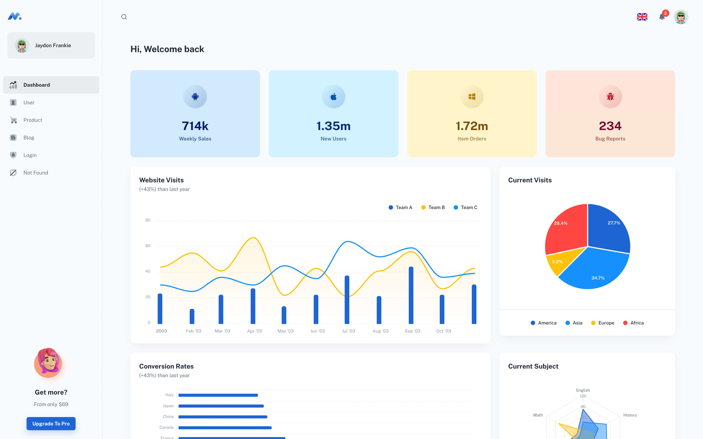

# EXAPP - Enterprise Resource Planning System

> Modern Enterprise Resource Planning & Inventory Management System built with React and Material-UI.

## Features

✓ Comprehensive ERP Solution
✓ Inventory Management
✓ Financial Reporting
✓ Multi-language Support
✓ Dark/Light Mode 🌓
✓ Real-time Analytics
✓ Mobile Responsive
✓ Enterprise Security
✓ Cloud Integration

## Modules

- Dashboard & Analytics
- Inventory Control
- Financial Management
- User Management
- Reports & Analytics
- System Settings
- Multi-branch Support
- Audit Trails

## Getting Started

- Recommended `node js 16.x` and `npm 6+`
- Install dependencies: `npm install` / `yarn install`
- Start the project: `npm run start` / `yarn start`

## License

Distributed under the MIT License. See [LICENSE](LICENSE.md) for more information.

## Contact Us

- Website: [https://exapp.online](https://exapp.online)
- Email: support@exapp.online
- WhatsApp: +971 58 236 6125
